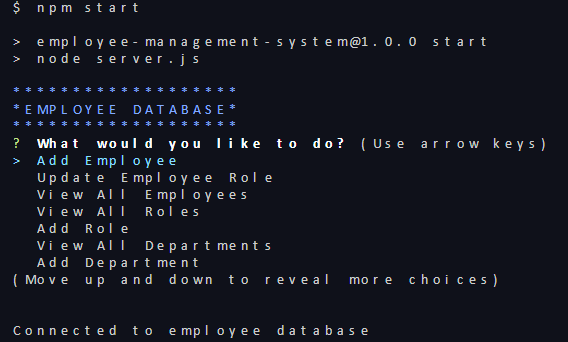

# EMPLOYEE DATABASE

### Step-By-Step Guide on how to interact with employee database from command line

#### 1. npm start command pops up a list of actions that are helpful to interact with employee database

#### 2. Select View all Employees to display list of all employees in the organization.
####
#### Follow same steps for View all Roles and View all Departments
####
####

#### 3. Select Add Employee to add new employee details. Please follow below screenshots to get more help on how to enter details

####
####
#### Following message would be displayed after new record addition
####
####
####

#### Please select respective category( role or department) and follow similar steps to enter new roles and departments

#### 4. Update Employee role. Below screenshots are helful to follow along and update an employee's role
####
####

####
####
#### 5. View Total Budget by Department. Below are the selections to choose to display total budget for the department selected
####
####

#### Video walkthrough links:
#### 1. https://drive.google.com/file/d/1BfZj_dRPfqjuZ03zhe_pQaWUV_2NJoai/view
#### 2. https://drive.google.com/file/d/1SzfWHnR2o911jCYxtzwnyB4J1Y0VaF76/view

###### last README update on 05/26/2022
